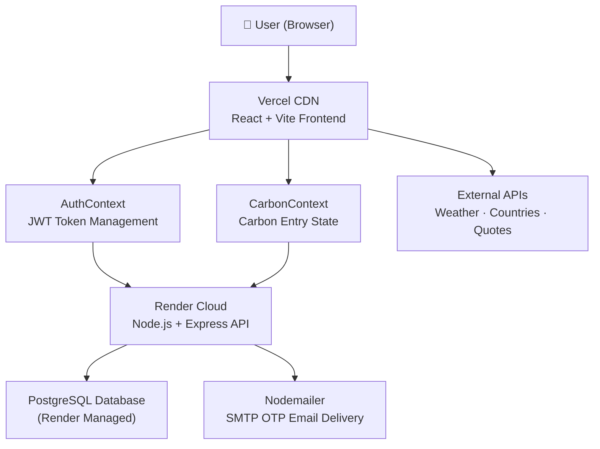

# CarbonWise — Carbon Footprint Awareness Platform

[](https://react.dev/)
[](https://vite.dev/)
[](https://tailwindcss.com/)
[](https://nodejs.org/)
[](https://www.postgresql.org/)
[](https://carbon-footprint-awareness-platform-alpha.vercel.app)
[](https://carbonwise-backend-4mq6.onrender.com/api/health)
[](https://vitest.dev/)
[](#accessibility--design-standards)

A **full-stack**, premium web application that helps individuals track, understand, and reduce their daily carbon footprint. CarbonWise combines a **React frontend** with a **Node.js + PostgreSQL backend**, delivering persistent cloud-synced data across devices, secure user authentication, OTP-based password recovery, 3D globe visualizations, real-time API integrations, and gamified achievements.

🌐 **Live Demo:** [https://carbon-footprint-awareness-platform-alpha.vercel.app](https://carbon-footprint-awareness-platform-alpha.vercel.app)

Developed for **[Challenge 3] Carbon Footprint Awareness Platform — Hack2Skill Prompt Wars**.

---

## System Architecture



---

## Key Features

### 🔐 Full Authentication System
- **Register / Login** with hashed passwords (bcrypt, 10 rounds)
- **JWT tokens** (7-day expiry) for stateless session management
- **OTP-based Password Reset** — 6-digit code delivered exclusively via email, valid for 5 minutes
- All sensitive routes protected by `authenticateToken` middleware

### 📊 Multi-Category Carbon Calculator
Granular tracking across four core emission pillars:
- **Transport:** Car (petrol/diesel/electric), public transit, air travel
- **Energy:** Electricity, natural gas, LPG cylinders
- **Food:** Meat-heavy, vegetarian, vegan diet types
- **Shopping:** Clothing, electronics, online deliveries

### ☁️ Cloud-Synced Data (PostgreSQL)
- All carbon entries, completed eco-tips, and user profiles persisted to a **Render PostgreSQL** cloud database
- Data syncs automatically on login — accessible from any device
- Full CRUD: add, delete individual entries, clear all history

### 🌍 Interactive 3D Earth Globe
- Built with raw **Three.js + WebGL** — rotating 3D Earth with ambient atmosphere glow and interactive country hotspots
- Graceful fallback to a 2D slate-blue canvas on WebGL-unsupported devices
- Completely bypassed on mobile (`< 1024px`) to preserve PageSpeed scores

### 🛡️ Robustness & Multi-User Readiness
- **Global Error Boundaries** to gracefully catch React crashes and display fallback UIs
- **Strict PropTypes** validation across all functional components to prevent runtime data bugs
- **ESLint** configured to enforce consistent code quality and prevent logical errors
- **Offline-to-Online Guest Sync:** Try the app as a guest, and your local data will seamlessly merge into your cloud database upon registration—no data lost!
- **Zero-Leakage Logout:** Hard-wipes browser `localStorage` and forces a React state refresh on logout to ensure total privacy on shared devices.

### 📈 Code-Split Analytics & Charts
- **7-Day Area Chart** — emissions trend vs. personal goal line
- **Category Pie Chart** — weekly breakdown by emission type
- Both lazy-loaded via `React.lazy()` for maximum performance

### 🏆 Gamified Achievements & Streaks
- **17 unlockable badges** for milestones like low-carbon travel, consistent logging, hitting weekly targets, and completing eco-tips
- **Flame streak counter** — tracks consecutive days below daily budget
- Responsive completion meter + badge showcase dialog

### 💡 Eco Tips Action Hub
- 30+ actionable environmental recommendations
- Categorized by impact level (High / Medium / Low)
- Daily seeded suggestions with persistent completion tracking (cloud-saved)

### 🌐 Real-Time External API Integrations
| API | Data Provided |
|---|---|
| **Open-Meteo** | Live weather + actionable suggestions based on conditions |
| **REST Countries** | Country flag, coordinates, per-capita carbon benchmark |
| **Quotable API** | Rotating environmental motivation quotes |

All fetches deferred **2000ms** post-mount to avoid blocking critical paint.

---

## Tech Stack

### Frontend
| Technology | Purpose |
|---|---|
| [React v19](https://react.dev/) | UI framework with hooks & context |
| [Vite v8](https://vite.dev/) | Build tool with HMR |
| [React Router v7](https://reactrouter.com/) | Client-side routing |
| [Tailwind CSS v4](https://tailwindcss.com/) | Utility-first styling |
| [Three.js](https://threejs.org/) | WebGL 3D Earth globe |
| [Recharts](https://recharts.org/) | Area & Pie data charts |
| [Lucide React](https://lucide.dev/) | Icon library |
| [Vitest](https://vitest.dev/) | Unit testing |
| [ESLint](https://eslint.org/) | Static code analysis & linting |
| [PropTypes](https://www.npmjs.com/package/prop-types) | Runtime type-checking for React props |

### Backend
| Technology | Purpose |
|---|---|
| [Node.js + Express](https://expressjs.com/) | REST API server |
| [PostgreSQL](https://www.postgresql.org/) | Relational database (Render managed) |
| [bcryptjs](https://github.com/dcodeIO/bcrypt.js) | Password hashing (10 rounds) |
| [jsonwebtoken](https://github.com/auth0/node-jsonwebtoken) | JWT auth tokens |
| [Nodemailer](https://nodemailer.com/) | OTP email delivery via SMTP |
| [pg](https://node-postgres.com/) | PostgreSQL client for Node.js |
| [dotenv](https://github.com/motdotla/dotenv) | Environment variable management |

### Deployment
| Service | Role |
|---|---|
| [Vercel](https://vercel.com) | Frontend hosting (CDN + auto-deploy) |
| [Render](https://render.com) | Backend API + PostgreSQL database |

---

## Project Structure

```text
Carbon Footprint Awareness Platform/
├── public/
│   ├── textures/
│   │   └── earth.jpg              # Local 3D Earth texture (92.57 KB)
│   └── sw.js                      # Service Worker (offline cache)
├── src/
│   ├── components/
│   │   ├── charts/
│   │   │   ├── DashboardAreaChart.jsx   # Lazy-loaded 7-day trend chart
│   │   │   └── DashboardPieChart.jsx    # Lazy-loaded category breakdown
│   │   ├── BadgesGrid.jsx
│   │   ├── CarbonCard.jsx
│   │   ├── EmissionGauge.jsx
│   │   ├── Globe3D.jsx            # WebGL Three.js rotating globe
│   │   ├── GlobeFallback.jsx      # 2D canvas fallback
│   │   ├── LocationAutocomplete.jsx
│   │   └── Navbar.jsx
│   ├── context/
│   │   ├── AuthContext.jsx        # JWT auth state, login/register/forgot-password
│   │   └── CarbonContext.jsx      # Carbon entry state + cloud sync
│   ├── hooks/
│   │   ├── use3DTilt.js           # Throttled 3D card tilt + holo shine
│   │   ├── useCountryData.js      # Deferred country statistics
│   │   ├── useWeather.js          # Deferred weather API
│   │   └── useQuote.js            # Deferred quote carousel
│   ├── pages/
│   │   ├── About.jsx
│   │   ├── Calculator.jsx         # Emission input forms
│   │   ├── Dashboard.jsx          # Metrics + globe + charts
│   │   ├── History.jsx            # Log table + export
│   │   ├── Login.jsx              # Login + Forgot Password OTP flow
│   │   └── Tips.jsx               # Eco tips hub
│   ├── utils/
│   │   ├── carbonCalculator.js    # EPA/IPCC emission coefficients
│   │   ├── calculations.js        # Format and conversion helpers
│   │   └── notifications.js       # Weekly digest + eco tip scheduler
│   ├── data/
│   │   └── tipsData.js            # 30+ eco tip definitions
│   ├── App.jsx                    # Routes + AppLoader + Suspense
│   ├── index.css                  # Design tokens + glassmorphism styles
│   └── main.jsx
├── server/
│   ├── db.js                      # PostgreSQL pool connection
│   ├── init-db.js                 # Auto-migration on startup
│   ├── schema.sql                 # Database schema
│   ├── server.js                  # Express REST API
│   ├── .env.example               # Environment variable template
│   └── package.json
├── vercel.json                    # SPA routing + cache-control headers
└── package.json
```

---

## Backend API Reference

*Note: Endpoints marked as **Required** need a valid JWT Bearer token sent in the `Authorization` header. Endpoints marked as **Public** can be accessed without logging in.*

### Authentication

| Method | Endpoint | Auth Required | Description |
|---|---|---|---|
| `POST` | `/api/auth/register` | Public | Register a new user |
| `POST` | `/api/auth/login` | Public | Login and receive JWT token |
| `GET` | `/api/auth/me` | Required | Get current user profile |
| `POST` | `/api/auth/forgot-password` | Public | Send OTP to email |
| `POST` | `/api/auth/reset-password` | Public | Verify OTP + set new password |

### Profile

| Method | Endpoint | Auth Required | Description |
|---|---|---|---|
| `PUT` | `/api/profile` | Required | Update name, location, goal, preferences |

### Carbon Entries

| Method | Endpoint | Auth Required | Description |
|---|---|---|---|
| `GET` | `/api/entries` | Required | Get all entries for current user |
| `POST` | `/api/entries` | Required | Log a new carbon entry |
| `DELETE` | `/api/entries/:id` | Required | Delete a specific entry |
| `DELETE` | `/api/entries` | Required | Clear all entries (reset history) |

### Eco Tips

| Method | Endpoint | Auth Required | Description |
|---|---|---|---|
| `GET` | `/api/tips` | Required | Get list of completed tip IDs |
| `POST` | `/api/tips` | Required | Toggle a tip as complete/incomplete |

---

## Database Schema

```sql
-- Users with profile preferences
CREATE TABLE users (
  id                          SERIAL PRIMARY KEY,
  email                       TEXT UNIQUE NOT NULL,
  password_hash               TEXT NOT NULL,
  name                        TEXT DEFAULT '',
  location                    TEXT DEFAULT '',
  monthly_goal                NUMERIC DEFAULT 150,
  diet_preference             TEXT DEFAULT 'omnivore',
  vehicle_type                TEXT DEFAULT 'petrol',
  notifications_weekly_report BOOLEAN DEFAULT true,
  notifications_goal_alerts   BOOLEAN DEFAULT true,
  notifications_eco_tips      BOOLEAN DEFAULT false,
  created_at                  TIMESTAMPTZ DEFAULT NOW()
);

-- Carbon footprint log entries
CREATE TABLE carbon_entries (
  id         SERIAL PRIMARY KEY,
  user_id    INTEGER REFERENCES users(id) ON DELETE CASCADE,
  date       TIMESTAMPTZ DEFAULT NOW(),
  category   TEXT NOT NULL,
  total_co2  NUMERIC NOT NULL,
  details    JSONB DEFAULT '{}'
);

-- OTP records for password reset
CREATE TABLE password_resets (
  email      TEXT PRIMARY KEY,
  otp        TEXT NOT NULL,
  expires_at TIMESTAMPTZ NOT NULL
);

-- Eco tips completion tracker
CREATE TABLE completed_tips (
  user_id    INTEGER REFERENCES users(id) ON DELETE CASCADE,
  tip_id     TEXT NOT NULL,
  PRIMARY KEY (user_id, tip_id)
);
```

---

## Emission Factors & Calculation Methodology

Calculations follow **EPA Emission Factors Hub**, **IPCC AR6**, and **CarbonIndependent.org**:

| Category | Activity | Coefficient | Unit |
|---|---|---|---|
| **Transport** | Car (Petrol) | `0.21` | kg CO₂/km |
| | Car (Diesel) | `0.23` | kg CO₂/km |
| | Car (Electric) | `0.05` | kg CO₂/km |
| | Public Transit | `0.04` | kg CO₂/km |
| | Flight | `0.15` | kg CO₂/km |
| **Energy** | Electricity (India grid) | `0.82` | kg CO₂/kWh |
| | Natural Gas | `2.02` | kg CO₂/m³ |
| | LPG Cylinder | `3.00` | kg CO₂/kg |
| **Food** | High Meat Diet | `7.20` | kg CO₂/day |
| | Vegetarian | `3.80` | kg CO₂/day |
| | Vegan | `2.90` | kg CO₂/day |
| **Shopping** | Clothing Item | `15.0` | kg CO₂/item |
| | Electronics | `120.0` | kg CO₂/item |
| | Online Delivery | `0.50` | kg CO₂/order |

**Baselines:** Global target `11.0 kg CO₂/day` · Monthly default budget `150 kg CO₂/month`

---

## Performance & Architecture Highlights

> [!IMPORTANT]
> **3D Globe Mobile Bypass:**
> Three.js WebGL shaders block CPU on mobile, degrading PageSpeed. CarbonWise detects viewports `< 1024px` and completely skips importing the `~510 KB` Globe3D module, preserving bandwidth and main-thread performance.

> [!TIP]
> **Code-Splitting:**
> All heavy components (charts, modals, WebGL) are code-split via `React.lazy()` + `<Suspense>`. This reduced the main bundle by **28%** (333 KB → 240 KB). A local Earth texture (`public/textures/earth.jpg`) eliminates external CDN dependencies.

> [!NOTE]
> **Cache Control (vercel.json):**
> `index.html` is served with `no-cache, no-store, must-revalidate` so users always receive the latest deployment instantly — no `Ctrl+Shift+R` needed. Hashed JS/CSS assets are cached for 1 year (`max-age=31536000, immutable`).

> [!NOTE]
> **OTP Security:**
> Password reset OTPs are never logged to the console or returned in API responses. They are stored hashed in PostgreSQL, expire in 5 minutes, and are consumed (deleted) immediately after a successful reset.

---

## How to Run Locally

### Prerequisites
- Node.js v18+
- PostgreSQL 14+ running locally
- Gmail App Password (or any SMTP credentials) for OTP emails

### 1. Clone the Repository
```bash
git clone https://github.com/meetchauhan17/Carbon-Footprint-Awareness-Platform.git
cd "Carbon-Footprint-Awareness-Platform"
```

### 2. Install Frontend Dependencies
```bash
npm install
```

### 3. Configure Frontend Environment
Create `.env` in the root:
```env
VITE_API_URL=http://localhost:5000/api
```

### 4. Install Backend Dependencies
```bash
cd server
npm install
```

### 5. Configure Backend Environment
Create `server/.env` (see `server/.env.example`):
```env
PORT=5000
DB_USER=postgres
DB_PASSWORD=your_postgres_password
DB_HOST=localhost
DB_PORT=5432
DB_DATABASE=carbonwise
JWT_SECRET=your_jwt_secret_here

# SMTP (required for OTP password reset)
SMTP_HOST=smtp.gmail.com
SMTP_PORT=587
SMTP_USER=your_email@gmail.com
SMTP_PASS=your_gmail_app_password
EMAIL_FROM="CarbonWise Support" <your_email@gmail.com>
```

> **Gmail App Password:** Go to Google Account → Security → 2-Step Verification → App Passwords → Generate one for "Mail".

### 6. Start Backend Server
```bash
# From the server/ directory
npm start
# Auto-creates tables and starts on port 5000
```

### 7. Start Frontend Dev Server
```bash
# From the project root
npm run dev
# Open http://localhost:5173
```

---

## Deployment Guide

### Frontend → Vercel
1. Push to GitHub — Vercel auto-deploys on every push to `main`
2. In **Vercel Dashboard → Settings → Environment Variables**, add:
   ```
   VITE_API_URL = https://carbonwise-backend-4mq6.onrender.com/api
   ```
3. Trigger a **Redeploy** after adding the variable

### Backend → Render
1. Create a new **Web Service** pointing to the `server/` folder
2. Set **Build Command:** `npm install`
3. Set **Start Command:** `npm start`
4. Add all environment variables in **Render Dashboard → Environment**:
   ```
   DATABASE_URL    = (provided by Render PostgreSQL)
   JWT_SECRET      = your_secret
   SMTP_HOST       = smtp.gmail.com
   SMTP_PORT       = 587
   SMTP_USER       = your_email@gmail.com
   SMTP_PASS       = your_app_password
   EMAIL_FROM      = "CarbonWise Support" <your_email@gmail.com>
   ```
5. Create a **PostgreSQL** service in Render and link its `DATABASE_URL`

---

## Accessibility & Design Standards

- **WCAG AA Compliant** — high contrast theme with curated `#F7931A` amber and `#10B981` green accents
- All inputs have descriptive `<label>` tags + `aria-label` attributes
- `prefers-reduced-motion` respected — disables all rotations, keyframe animations, and 3D tilt effects
- Touch-only devices skip mouse listeners — saving battery and CPU

---

## How to Test

```bash
# Run all 38 unit tests
npm run test

# Generate code coverage report
npm run test:coverage
```

---

## Acknowledgements

- Emission factors from **US EPA**, **IPCC AR6**, and **CarbonIndependent.org**
- Weather data from **[Open-Meteo](https://open-meteo.com/)** (free, no API key required)
- Country data from **[REST Countries](https://restcountries.com/)**
- Environmental quotes from **[Quotable API](https://api.quotable.io/)**
- Earth texture from **NASA Blue Marble** imagery (local, no CDN dependency)
